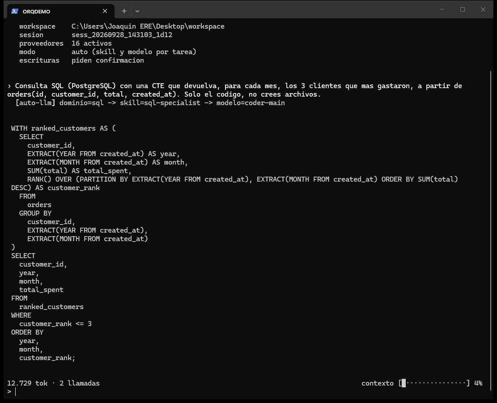

# Orquestador de Modelos Especializados — prototipo fase 1

> **English summary** — Agentic terminal that routes each task to a specialist (skill + model) across 21 domains, with failover over free-tier OpenAI-compatible LLM providers. FastAPI gateway, Qdrant hard-case RAG, a routing eval that gates CI, and 1,097 tests.




## Instalación rápida

**Windows (PowerShell):**
```powershell
irm https://raw.githubusercontent.com/VortexJer/orquestador/main/install.ps1 | iex
```

**Linux / macOS:**
```bash
curl -fsSL https://raw.githubusercontent.com/VortexJer/orquestador/main/install.sh | bash
```

El instalador clona el repo, crea el entorno virtual, instala las dependencias,
prepara el `.env` y deja el comando `orquestador` disponible. Después:

```
orquestador --config      # añade tus API keys (gratis, sin tarjeta), una a una
orquestador               # abre la terminal agéntica
```

¿Ya usas **NovaChat**? Inicia sesión una vez e importa tus keys de la cuenta
(suma, sin duplicar; luego se sincronizan solas en cada arranque):
```
orquestador --account       # (alias -acc)
```


Implementacion del especialista Python end-to-end (router -> skill ->
ciclo de herramientas -> RAG de casos dificiles -> validacion final ->
trazabilidad), mas el especialista `generalist-tiny` para tareas
triviales no verificables. Ver el documento de arquitectura para el
diseño completo y el roadmap de fases siguientes.

El catalogo de skills + bases de casos dificiles + herramientas ya
cubre 12 lenguajes de codigo + seguridad + IaC + creacion de sitios web
(HTML/CSS + scraping/busqueda/analisis de imagenes/render real) + 4
tareas de oficina (correo, Word, Excel, PowerPoint) - ver "Estado del
catalogo" mas abajo para que esta activo en produccion hoy vs. que esta
listo para probarse con la terminal agentica de pruebas (`groq_agent/`).

Corre sin GPU: por defecto `INFERENCE_MODE=mock`, un cliente de
inferencia simulado que devuelve respuestas deterministicas (incluida
una version con un bug real de lint en el primer intento, para
ejercitar de verdad el ciclo de correccion). Esto permite validar toda
la logica de orquestacion, RAG y herramientas antes de gastar en GPU.

## Instalacion

```bash
python -m venv .venv
source .venv/bin/activate  # o .venv\Scripts\activate en Windows
pip install -r requirements-dev.txt
playwright install chromium   # solo si vas a usar render_check (web-builder)
cp .env.example .env
```

## Cargar la base de casos dificiles (Qdrant embebido, sin Docker)

```bash
python -m app.rag.ingest
```

## Levantar el gateway

```bash
uvicorn app.main:app --reload --port 8080
```

Probar:

```bash
python scripts/smoke_test.py --base-url http://localhost:8080 --api-key dev-local-key
```

## Tests

```bash
pytest -q
```

## Medir la exactitud del router (criterio de aceptacion de fase 1)

```bash
python -m eval.scripts.eval_router
```

Sale con codigo distinto de cero si la exactitud queda por debajo de
`ROUTER_EVAL_MIN_ACCURACY` (0.85 por defecto) - no promover un router
nuevo a produccion si esto falla.

## Prueba de carga (solo tiene sentido contra un backend real, no mock)

```bash
python scripts/load_test.py --base-url http://localhost:8080 --levels 1,2,4,8,16,24,32
```

## Pasar a un modelo real (todavia sin la GPU de produccion)

Si queres validar con un modelo de verdad antes de alquilar la L4,
serví `Qwen2.5-Coder-7B-Instruct` con `llama.cpp server` u Ollama en
modo OpenAI-compatible, y cambiá en `.env`:

```
INFERENCE_MODE=http
INFERENCE_BASE_URL=http://localhost:<puerto-de-tu-servidor>/v1
```

No hace falta tocar ninguna otra parte del codigo - el cliente HTTP es
el mismo que se usa contra vLLM en produccion.

## Ir al servidor GPU real

Cuando tengas la GPU alquilada (RunPod/Modal, L4 24GB), copia este
repo al servidor y dale el archivo `DEPLOY_PROMPT.txt` a una sesion de
Claude Code corriendo ahi - ese prompt esta escrito para que termine la
configuracion (bajar los pesos reales, levantar vLLM, correr
`eval_router.py` y `load_test.py` contra el backend real, y reportar
los numeros).

## Estado del catalogo (fase 1)

Solo `python-specialist` y `generalist-tiny` estan `enabled: true` en
`config/specialists.yaml` dentro del orquestador de produccion (el que
sirve `/v1/generate`). El resto del catalogo - 12 lenguajes de codigo
(typescript, javascript, java, csharp, cpp, go, rust, php, ruby,
kotlin, sql, seguridad, iac), `web-builder-specialist`, y 4 tareas de
oficina (correo, word, excel, pptx) - ya tiene su `skill.md` completo,
su coleccion de casos dificiles, y sus herramientas documentadas en
`config/tools_catalog.yaml`, pero esta `enabled: false` hasta que le
toque su fase (ver roadmap del doc de arquitectura). `web-builder-specialist`
es el unico con su tool_runner 100% implementado y probado aunque siga
deshabilitado en produccion (ver mas abajo). El router heuristico ya
conoce y clasifica los 21 dominios (ver `eval/router_eval_set.json`, 69
casos, 100% de exactitud medida) y degrada graciosamente al fallback de
su familia (`python-specialist` para dominios de codigo, `generalist-tiny`
para tareas de oficina) cuando el especialista ideal todavia esta
deshabilitado.

Base de casos dificiles: `hard_cases/by_domain/*.json`, un archivo por
dominio (128 entradas en total). `python -m app.rag.ingest` carga TODOS
los archivos de esa carpeta - agregar un dominio nuevo es agregar un
archivo, no tocar el script.

### Herramientas de web-builder (reales, ya probadas contra internet)

`app/tools/`: `web_scraper.py` (fetch + extraccion de horarios/telefono/
rating via JSON-LD schema.org), `web_lint.py` (estructura HTML),
`image_search.py` (Pexels/Unsplash/Pixabay, royalty-free - requiere una
API key gratis por fuente, ver el error que devuelve si falta),
`image_analysis.py` (color dominante, brillo, calidez, nitidez/borrosidad,
resolucion de una imagen - para decidir COMO usarla antes de elegirla,
no despues), `web_search.py` (DuckDuckGo, sin API key), `link_checker.py`
(links rotos), `render_check.py` (renderiza en Chromium headless real vía
Playwright y devuelve captura + errores de consola/JS - requiere
`playwright install chromium` una vez).

## Probar los skills nuevos con modelos reales (API de OpenRouter)

Mientras el catalogo ampliado no esta wireado en el orquestador de
produccion (fase 2+), `groq_agent/` es una terminal agentica de
pruebas - al estilo Claude Code - que le da a un modelo servido por
OpenRouter (o cualquier endpoint OpenAI-compatible, ver `LLM_PROVIDER`
en `groq_agent/groq_client.py`) acceso de lectura/escritura/edicion de
archivos, busqueda en la base de casos dificiles, y generacion de
documentos (.docx/.xlsx/.pptx), confinado a una carpeta de trabajo.
Sirve para validar cualquiera de los 20 skills contra un modelo real
sin esperar a tener la GPU propia.

Se uso Groq al principio, pero su catalogo bajo 24B es muy chico (en la
practica, solo 2 opciones utiles: 8B y 20B). Se cambio a OpenRouter
porque agrega decenas de proveedores en un solo catalogo, con variedad
real de modelos de codigo en el rango 7B-32B (Qwen2.5/3-Coder,
Mistral Small, etc.) - mas fiel al objetivo de "muchos modelos chicos
especializados", no solo 1-2 opciones repetidas.

### Arranque rapido

```powershell
cp .env.example .env
.\orquestador.ps1 --config   # te pide las API keys que falten, una a una
.\orquestador.ps1
```

`orquestador.ps1` activa el venv, carga `.env`, y entra en **modo auto**:
cada tarea que escribas se clasifica sola (misma logica de dominio que
el router de produccion, `app/router/heuristic_router.classify_domain`)
y se le asigna el skill Y el modelo automaticamente - ver
`groq_agent/auto_router.py`. Para que "orquestador" funcione como
comando desde cualquier carpeta, ver el comentario al final de
`orquestador.ps1` (agrega una funcion a tu `$PROFILE` de PowerShell -
no lo hacemos automatico porque es un archivo tuyo, fuera del repo).

```
PS> .\orquestador.ps1
Modo: auto (skill y modelo se eligen por tarea)
tarea> Escribe una funcion es_primo(n) con tests
  [auto] dominio=python -> skill=python-specialist -> modelo=qwen/qwen-2.5-coder-32b-instruct
  ...
```

### Sobre que modelos elige el modo auto

OpenRouter no hostea los modelos exactos del catalogo real
(Qwen2.5-Coder-14B, etc.), pero el objetivo siempre fue "modelos que
quepan en una GPU de 24GB", no modelos frontera. `auto_router.py` mapea
los mismos niveles que ya estan en `config/specialists.yaml`
(`base_model_ref`) a un modelo real y comparable en tamaño:

| Nivel del catalogo real | Modelo usado hoy (OpenRouter) |
|---|---|
| `router-tiny` (~1.5B, tareas triviales/oficina chica) | `meta-llama/llama-3.2-3b-instruct` |
| `coder-main` (~14B, la mayoria de los especialistas) | `qwen/qwen-2.5-coder-32b-instruct` (modelo dedicado a codigo, no generalista) |
| `devstral-agentic` (~24B, agentico/tool-use) | `qwen/qwen3-coder-30b-a3b-instruct` (MoE, 3.3B activos por token) |
| `escalation-30b` (respaldo final) | `mistralai/mistral-small-3.2-24b-instruct` |

Nunca se usa un modelo de 70B/120B por default - eso invalidaria el
sentido de la prueba. Podes forzar otro con `--model` si queres
comparar, y `--list-models` te muestra que hay disponible con tu key
hoy (cambia con el tiempo).

### Sesiones (como `claude -c` / `claude -r`)

Cada tarea que corres queda guardada en `<workspace>/.orquestador_sessions/`
(un archivo JSON por sesion, con el historial de mensajes por especialista).

```powershell
orquestador -c                        # continua la sesion mas reciente de este workspace
orquestador -r                        # elegir una sesion anterior de una lista
orquestador -r sess_20260703_215431_dd28   # retomar una puntual por id
```

Al arrancar, la terminal siempre imprime el id de la sesion actual para
poder retomarla despues. `-c` funciona incluso si la tarea anterior se
corto por un error de la API (rate limit, etc.) a mitad de camino: el
progreso ya hecho (archivos ya escritos, herramientas ya corridas) se
guarda igual, asi que continuar no repite trabajo ya hecho - probado en
esta sesion de desarrollo: se corto por rate limit despues de escribir
2 archivos, y al continuar con `-c` el modelo sabia exactamente que
habia escrito sin que se le repitiera.

### Comandos manuales (forzar skill/modelo especifico)

```bash
python -m groq_agent.cli --list-skills
python -m groq_agent.cli --skill python-specialist --workspace ./mi_proyecto \
    "Revisa validators.py y agrega tests para los casos limite"
python -m groq_agent.cli --skill web-builder-specialist --model qwen/qwen3-coder-30b-a3b-instruct \
    --workspace ./mi_sitio "Landing page para mi restaurante"
```

Seguridad: todas las herramientas de archivo estan confinadas al
`--workspace` elegido (no pueden salir de esa carpeta); las que
escriben/ejecutan algo (`write_file`, `edit_file`, `run_check`,
`generate_*`) piden confirmacion antes de aplicarse salvo `--yes`. No
hay una herramienta de shell arbitrario - `run_check` solo permite
ruff/mypy/pytest, nada mas, precisamente para no darle a un modelo de
terceros ejecucion de comandos sin restriccion sobre tu maquina.

`groq_agent/` es una herramienta de desarrollo local - no hace falta
llevarla al servidor GPU (ver `DEPLOY_PROMPT.txt`).

### Hallazgos reales de las primeras pruebas en vivo

- Con `python-specialist` (modelo chico via el modo auto) una tarea
  real anduvo de punta a punta: escribio el codigo y los tests,
  corrigio un error real de ruff en la segunda vuelta, tests en verde -
  con un modelo del tamaño que de verdad entraria en la GPU objetivo,
  no un modelo frontera.
- Con modelos grandes probados en la fase de Groq, a veces aparecia una
  tool call mal formada que el proveedor rechaza (`tool_use_failed`) -
  la terminal ya lo maneja (reintenta pidiendole al modelo que corrija,
  no crashea). Falta re-confirmar si esto se repite con el catalogo de
  OpenRouter.
- Algunos modelos mandan argumentos que el schema no esperaba
  estrictamente (ej. un `path` extra o vacio en `run_check`) - las
  herramientas ya son tolerantes a eso, pero es una señal real de que
  el mismo skill se comporta distinto segun el modelo que lo corre,
  que es exactamente lo que esta terminal esta pensada para exponer.
- Cada proveedor tiene sus propios limites de tokens-por-minuto/rate
  limit - si te tira un error 429, esperá unos segundos entre tareas o
  revisá el dashboard de tu cuenta en OpenRouter.
